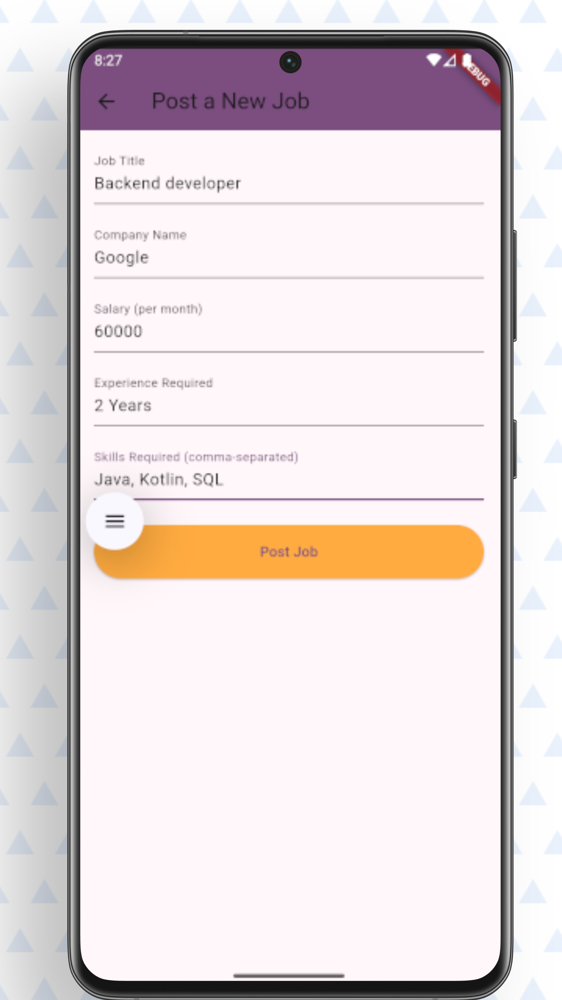

#  pathXplore

> 🚀 Explore internships, grow skills, and launch your career — all in one app!

---

##  About

`pathXplore` is a comprehensive platform built with **Flutter**, providing users with a seamless way to browse, select, and apply for internships—complete with skill development tracking and engaging application tools.

---

##  Key Features

- 🕵️ **Browse Internships** — Discover opportunities tailored to your skills.
-  **Skill Tracker & Courses** — Build new skills through curated content.
-  **Quick Apply** — Submit applications in just a few taps.
-  **Certification Boost** — Gain certificates to enhance your portfolio.
- 🤝 **Seamless UI/UX** — Modern and intuitive design powered by Flutter.

---

##  Preview


|  |  |
|-------------------------------|-------------------------------|
|  |  |



---

##  Tech Stack

- **Framework:** Flutter (cross-platform mobile)
- **Language:** Dart
- **State Management:** (e.g., Provider, Company, Job Seeker)
- **Backend & Database:** (Optional — e.g., Firebase Firestore / REST API)

---

## 🛠 Prerequisites

- [Flutter SDK](https://flutter.dev/docs/get-started/install)
- [Dart](https://dart.dev/get-dart)
- Android Studio / VS Code

---

##  How to Run Locally

```bash
# 1. Clone the repo
git clone https://github.com/MADHANKUMAR-C/pathXplore.git

# 2. Navigate into the project
cd pathXplore

# 3. Fetch dependencies
flutter pub get

# 4. Launch the app
flutter run
```

---

##  Organization & Directory Structure

```bash
pathXplore/
│
├── android/ & ios/ / web/ (platform-specific code)
├── lib/        — Main app logic and UI (Dart files)
├── screenshots/— App UI screenshots
├── pubspec.yaml
├── README.md
└── ...         — Other config and metadata files
```

---

##  Get in Touch

- **Developer:** Madhan Kumar  
- **Email:** [madhankumar8825487841@gmail.com](mailto:madhankumar8825487841@gmail.com)  
- **LinkedIn:** [Madhan Kumar C](https://www.linkedin.com/in/madhankumar-c-601132273)
  
---

##  Add star/fork badge

[](https://github.com/MADHANKUMAR-C/pathXplore/stargazers)
